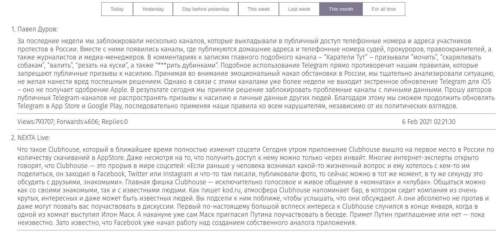

Telegram-parser
----
The Telegram parser find most popular messages from Telegram and provide sorted lists of them via API and UI. 

UI is available on port 8000.

## Prerequisites and launch
1. Install and start database (PostgreSQL)
2. Run RabbitMQ in docker container
3. Set environment variables:

   - RABBITPORT - Port on which rabbitMQ is listened.
   
   - PGHOST - Host on which postgreSQL is listened.
   - PGPORT - Port on which postgreSQL is listened.
   - PGUSER - PostgreSQL user name.
   - PGPASSWORD - Password to access postgreSQL.
   - PGDBNAME - PostgreSQL database name.            DEPRECATE
   - TGTELNUMBER - Phone number required to connect to the telegram client.
   - TGAPIID - Application identifier for Telegram API access, which can be obtained at https://my.telegram.org.
   - TGAPIHASH - Application identifier hash for Telegram API access, which can be obtained at https://my.telegram.org.
   
4. Untar modified vendor: 

        tar -xvf vendor.tar
        
5. Build and run app:
        
        go build 
        
        ./telegram-parser -mod=vendor

## UI
UI is available on port 8000

> Example of using UI

## API
Get the best posts for a period:

`http://localhost:8000/best?period=${period}`

Available time periods:

- today
- yesterday
- daybeforeyesterday
- thisweek
- lastweek
- thismonth
- whole (Denotes the entire period from 1970-01-01T00: 00: 00Z to the present)
